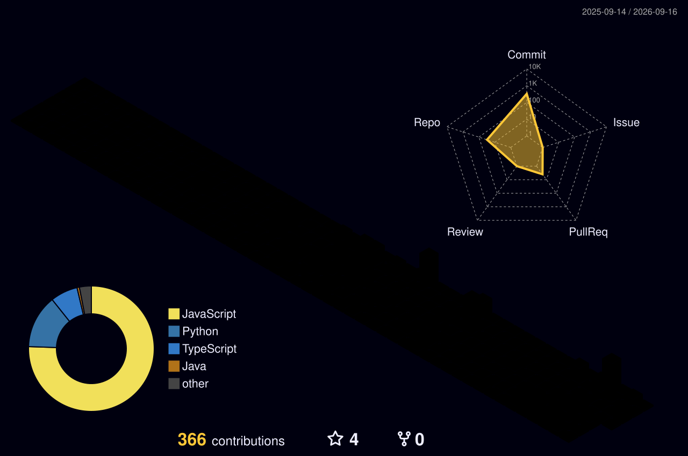

<h1 align="center">Hey there, I'm Naman 👋</h1>

  

  
  
  

---

## 🧑‍💻 About Me

- 💼 All of my projects live at **[@naman-c25](https://github.com/naman-c25?tab=repositories)**
- 🖥️ Check out my portfolio → **[naman.dev](https://portfolio-three-eosin-54.vercel.app/)**
- 💬 Ask me about **React, Node.js, MongoDB, TypeScript, and AI integrations**
- 📫 Reach me at **namanchaudhary251020@gmail.com**
- 📍 Based in **New Delhi, India**
- ⚡ Fun fact: I debug better at 2 AM than at 2 PM

---

## 🌐 Connect With Me

  
  
  
  

---

## 🛠️ Tech Stack

> [!IMPORTANT]
> These are the technologies and tools I actively build with.

<b>💻 Languages</b>

 

  
  
  
  
  
  

<b>⚛️ Frontend</b>

 

  
  
  
  
  

<b>⚙️ Backend</b>

 

  
  
  
  

<b>🗄️ Databases</b>

 

  
  
  

<b>☁️ Cloud & Tools</b>

 

  
  
  
  
  
  

---

## 🚀 Featured Projects

<table>
<tr>
<td width="50%" valign="top">

### 🎯 [Naulej](https://github.com/naman-c25/Naulej)
Full-stack job platform connecting students with recruiters, featuring **AI-powered ATS resume scoring**.

`React 19` `Express 5` `MongoDB` `OpenAI` `AWS S3`

- JWT + Google OAuth with role-based access
- Single-call `gpt-4o-mini` resume analysis
- S3 presigned URLs + Razorpay HMAC verification

</td>
<td width="50%" valign="top">

### 💰 [Finance Advisor & Expense Tracker](https://github.com/naman-c25/Finance-Advisor-and-Expense-Tracker)
A personal finance **PWA** for tracking expenses, setting savings goals, and getting AI-powered advice.

`React 19` `TypeScript` `Vite` `MUI` `Firebase`

- Google Gemini for financial insights
- Multi-currency support (INR/USD/EUR/GBP)

</td>
</tr>
<tr>
<td width="50%" valign="top">

### 🏥 [SmartDiagnosis](https://github.com/naman-c25/SmartDiagnosis)
Generates diagnoses from precise symptoms using AI.

`JavaScript` `AI`

</td>
<td width="50%" valign="top">

### ⚡ [FlashDB](https://github.com/naman-c25/FlashDB)
A lightweight database implementation built from scratch.

`Java`

</td>
</tr>
</table>

  <a href="https://github.com/naman-c25?tab=repositories"><b>→ Explore all my repositories</b></a>

---

## 📊 GitHub Stats

  
  

  

  

---

## 🧊 3D Contributions

  

---

## 🏆 GitHub Trophies

  

---

  <i>Thank you for visiting my profile! If you like my work, consider starring a repo ⭐</i>

  

